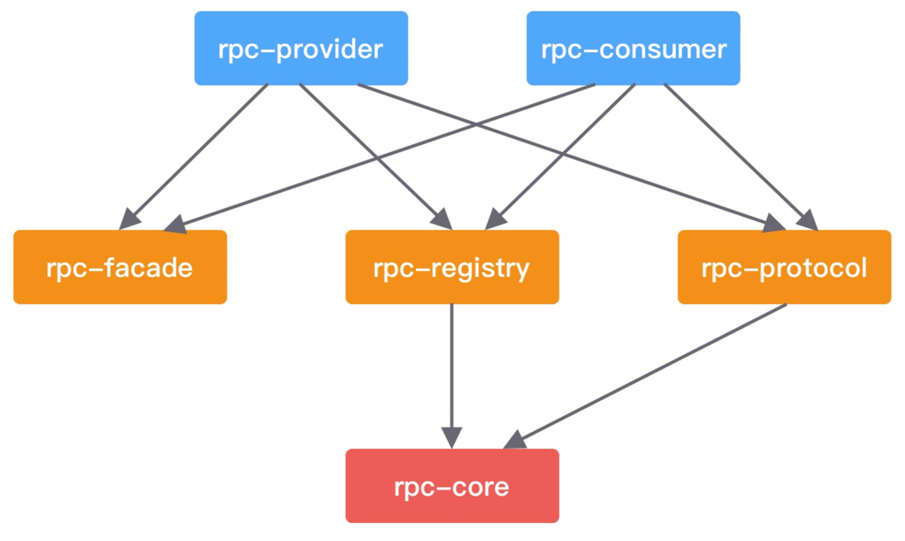

## 简介

本项目是基于 Java 实现的分布式 RPC 框架。

### 模块

* rpc-provider：服务提供者。负责发布 RPC 服务，接收和处理 RPC 请求。
* rpc-consumer：服务消费者。使用动态代理发起 RPC 远程调用，帮助使用者来屏蔽底层网络通信的细节。
* rpc-registry：注册中心模块。提供服务注册、服务发现、负载均衡的基本功能。
* rpc-protocol：网络通信模块。包含 RPC 协议的编解码器、序列化和反序列化工具等。
* rpc-core：基础类库。提供通用的工具类以及模型定义，例如 RPC 请求和响应类、RPC 服务元数据类等。
* rpc-facade：RPC 服务接口。包含服务提供者需要对外暴露的接口，本模块主要用于模拟真实 RPC 调用的测试。

## 使用

```java
  // rpc-facade # HelloFacade
public interface HelloFacade {
    String hello(String name);
}

// rpc-provider # HelloFacadeImpl
@RpcService(serviceInterface = HelloFacade.class, serviceVersion = "1.0.0")
public class HelloFacadeImpl implements HelloFacade {
    @Override
    public String hello(String name) {
        return "hello" + name;
    }
}

// rpc-consumer # HelloController
@RestController
public class HelloController {
    @RpcReference(serviceVersion = "1.0.0", timeout = 3000)
    private HelloFacade helloFacade;

    @RequestMapping(value = "/hello", method = RequestMethod.GET)
    public String sayHello() {
        return helloFacade.hello("mini rpc");
    }
}
```

为了方便在本地模拟客户端和服务端，我会把 rpc-provider 和 rpc-consumer 两个模块能够做到独立启动。

* rpc-provider 通过 @RpcService 注解暴露 RPC 服务 HelloFacade。
* rpc-consumer 通过 @RpcReference 注解引用 HelloFacade 服务并发起调用，基本与我们常用的 RPC 框架使用方式保持一致。
